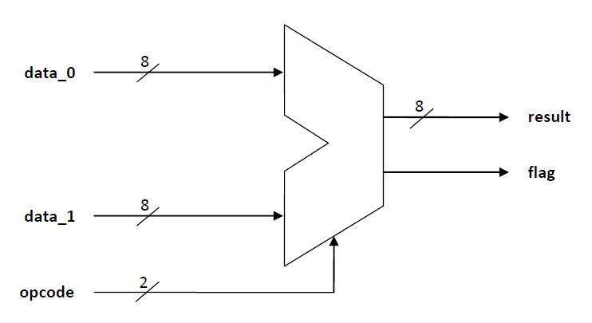
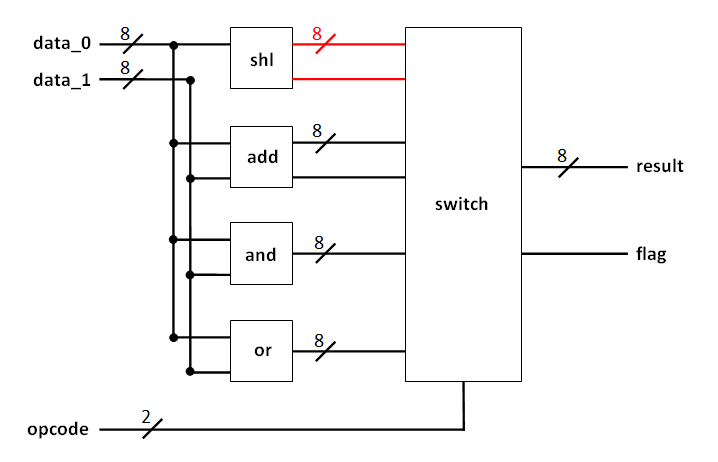

# Simple ALU
This is a toy example of using VHDL for building arithmetic logic circuits.

The file `ALU.vhd` describes the architecture of the entire ALU module in the
so called _structural modelling style_ where we connect each subcomponents with
with signals into a complex unit.

The ALU as a whole can be depicted as shown in the following image.

We want to use two 8-bit words and a 2-bit opcode which decides what operation
we execute on the two inputs. After executing the selected operation we get a
result of the length of 8 bits and a flag bit which can be used for specific
purposes depending on the actual operation.

The two-bit opcode allows us to use four different operations. These are the
following:

| Opcode | Operation |
|  :---: |   :---:   |
|  `00`  | `shift_left` |
|  `01`  | `add` |
|  `10`  | `and` |
|  `11`  | `or` |

Respecting the previously chosen operations and their opcodes we can imagine
a schematic design for our ALU's inner structure.

The modules mentioned above are implemented in the corresponding `*.vhd` files
and the `ALU_test.vhd` contains a testbench entity for testing the ALU with
random inputs.
