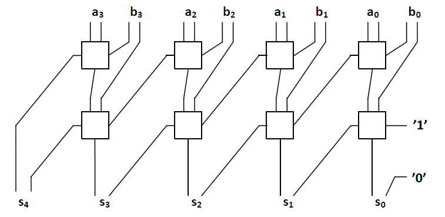
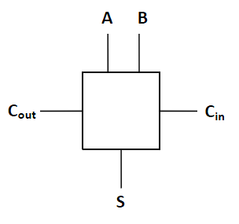

# Redundant binary adder
The most common types of binary adders implemented in integrated circuits use
the classic binary numeral system representation for the operands and the
result. For subtraction they utilize the two's complement form of the numbers.

From an engineering point of view this approach is really simple to implement
because we need to use one full adder circuit per bit and after feeding them
with the two input numbers the only thing we need to do is reading the result
on the other end of the adder array. **But** just like with addition by hand
every bit needs the information about the previous (lower place-value position)
bits' carries. Therefore, the computation time scales up with the size of the
operands.

This phenomenon has no significant effect on modern CPUs and GPUs (typically
with 64, 128, 256, 512 bits word-width) partially because of the efficient
carry-lookahead adders but for really large numbers it is worth considering
the use of some alternative solutions.

One of such alternatives is the redundant binary adder (RBA). To be able to
utilize RBA's advantages first we need to convert our operands to the
_redundant binary representation_. In this form every binary digit requires
two bits to be represented because there are not only `0`s and `1`s but `0`s,
`1`s and `-1`s. The name _redundant_ comes from the fact that most numbers have
more than one representations.

After fulfilling this requirement we can build an adder array out of classic
full adder components which adds two numbers of any length in constant time
without waiting for the carry signals. The schematics of such an adder can be
seen in the following picture.

For the sake of clarity we labeled the legs of the full adders used above.

The main drawback of this kind of circuits is the cost of conversion between
the classic binary and the redundant representation which both need a
carry-aware addition. If we only need to add two numbers the RBA solution is
way inefficient but in applications where many of additions and addition based
multiplications occur the partial sums do not need to be converted only the
final result. This approach can be helpful in several coprocessor-accelerated
HPC applications or in hardware-based cryptography devices.

## Implementation
The RBA implementation in this VHDL project is a small example which would be
very inefficient in real life as it is expected, considering the above mentioned
properties but it is suitable for demonstration purposes.
